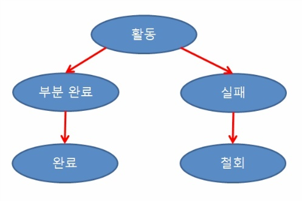

# 트랜잭션을 알아보자!

## 트랜잭션의 성질
### 원자성(Atomicity)
1. ALL OR NOTHING
### 일관성(Consistency)
1. 트랜잭션을 성공적으로 완료하면 언제나 일관성 있는 DB상태로 변환한다
2. 고정요소의 상태는 트랜잭션과 무관해야한다.
### 독립성(Isolation)
1. 둘 이상의 트랜잭션이 동시 병행 실행될 경우 서로간의 연산에 끼어들 수 없다.
2. 수행중인 트랜잭션은 완전히 완료될 때까지 다른 트랜잭션에서 결과를 참조할 수 없다
### 영속성(Durability)
1. 성공적으로 완료된 트랜잭션의 결과는 시스템이 고장나더라도 영구적으로 반영되어야 한다.

## 트랜잭션 연산 및 상태
## Commit연산
1. Commit 연산은 한개의 논리적 단위(트랜잭션)에 대한 작업이 성공적으로 끝났고 데이터베이스가 다시 일관된 상태에 있을 때, 이 트랜잭션이 행한 갱신 연산이 완료된 것을 트랜잭션 관리자에게 알려주는 연산이다.
## Rollback연산
1. Rollback 연산은 하나의 트랜잭션 처리가 비정상적으로 종료되어 데이터베이스의 일관성을 깨뜨렸을 때, 이 트랜잭션의 일부가 정상적으로 처리되었더라도 트랜잭션의 원자성을 구현하기 위해 이 트랜잭션이 행한 모든 연산을 취소(Undo)하는 연산이다.
2. Rollback시에는 해당 트랜잭션을 재시작하거나 폐기한다.

## 트랜잭션 상태

- 활동(Active) : 트랜잭션이 실행중인 상태
- 실패(Failed) : 트랜잭션 실행에 오류가 발생하여 중단된 상태
- 철회(Aborted) : 트랜잭션이 비정상적으로 종료되어 Rollback 연산을 수행한 상태
- 부분 완료(Partially Committed) : 트랜잭션의 마지막 연산까지 실행했지만, Commit 연산이 실행되기 직전의 상태
- 완료(Committed) : 트랜잭션이 성공적으로 종료되어 Commit 연산을 실행한 후의 상태

## Spring의 트랜잭션 추상화

참조
https://coding-factory.tistory.com/226
https://mangkyu.tistory.com/154